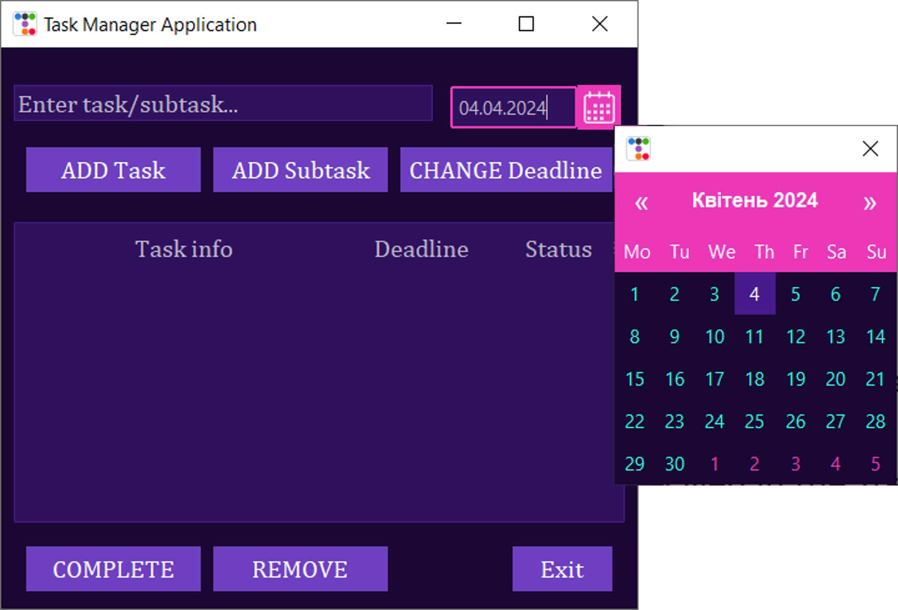

# Task-Manager-Application
## Overview
Task Manager Application (TMA) provides a graphical user interface that enables users to:
* `Add` new tasks, 
* `Add` new subtasks to the existing ones, 
* `Remove` tasks/subtasks, 
* `Change deadline` on existing tasks/subtasks, 
* mark tasks/subtasks as `Done`. 

As well as allowing the user to save all added tasks/subtasks after closing the application and loading them after opening it again. 
TMA is based on Graphical User Interface (GUI) is a visual representation of interactive components of a computer program. The standard Python GUI module **Tkinter**, and it`s extensions, have been used in this application. 
GUI allows users to easily interact with computer programs with the use of interactive visual components such as buttons, toolbars, menus, textboxes, etc. 

The GUI for application consists of:
  * Root window container that holds all other GUI widgets/components.
  * Main treeview to display tasks/subtasks data in hierarchical form.
  * Versatile calendar window to enter/change task/subtask deadline in a date format. 
  * Functional buttons, text entry fields to enable users to interact with the essential features of the GUI.

## Getting started
Installation requirements: 
* Preferably Python 3.7 or greater for Windows. If you have Python 3.6 or an earlier version, you can simply upgrade to a newer Python version that includes the latest version of Tkinter.
* **ttkbootstrap**, a theme extension for **Tkinter**, which style themes have been used in this application. To install this, within your terminal enter `pip install ttkbootstrap`. 
* Python module **tkcalendar**, that provides the **DateEntry** widget for **Tkinter**, is also required. To install this, within your terminal enter `pip install tkcalendar `.

## Task Manager Application Preview
1.	Layout and the hierarchy of tasks preview:

