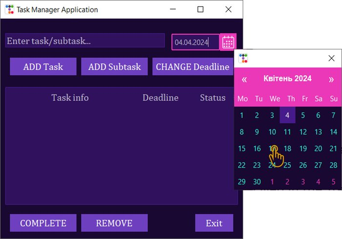
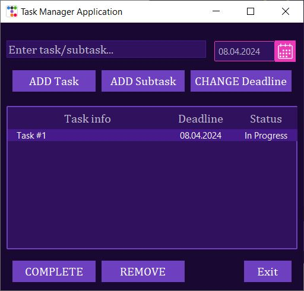

# Task-Manager-Application
## Overview
Task Manager Application (TMA) provides a graphical user interface that enables users to:
* `Add` new tasks, 
* `Add` new subtasks to the existing ones, 
* `Remove` tasks/subtasks, 
* `Change deadline` on existing tasks/subtasks, 
* mark tasks/subtasks as `Done`. 

As well as allowing the user to save all added tasks/subtasks after closing the application and loading them after opening it again. 
TMA is based on Graphical User Interface (GUI) is a visual representation of interactive components of a computer program. The standard Python GUI module **Tkinter**, and it`s extensions, have been used in this application. 
GUI allows users to easily interact with computer programs with the use of interactive visual components such as buttons, toolbars, menus, textboxes, etc. 

The GUI for application consists of:
  * Root window container that holds all other GUI widgets/components.
  * Main treeview to display tasks/subtasks data in hierarchical form.
  * Versatile calendar window to enter/change task/subtask deadline in a date format. 
  * Functional buttons, text entry fields to enable users to interact with the essential features of the GUI.

## Getting started
Installation requirements: 
* Preferably Python 3.7 or greater for Windows. If you have Python 3.6 or an earlier version, you can simply upgrade to a newer Python version that includes the latest version of Tkinter.
* **ttkbootstrap**, a theme extension for **Tkinter**, which style themes have been used in this application. To install this, within your terminal enter `pip install ttkbootstrap`. 
* Python module **tkcalendar**, that provides the **DateEntry** widget for **Tkinter**, is also required. To install this, within your terminal enter `pip install tkcalendar `.

## Task Manager Application Preview
1. Layout and the hierarchy of tasks preview:

2. Calendar opening and preview:
* 2.1.	Click on Calendar icon.
* 2.2.	After window popped up – select date. It will close immediately afterwards.

3. Add Task flow and preview:  
* 3.1.	Enter new task in task entry field.
* 3.2.	Click on Calendar icon to open pop-up Calendar window. Select deadline.
* 3.3.	Press `ADD Task`
* 3.4.	The added task will appear displayed in the Treeview below:

4. Add Subtask flow and preview:  
* 4.1.	Enter Subtask in task entry field.
* 4.2.	Click on Calendar icon to open pop-up Calendar window. Select deadline.
* 4.3.	Select Task from Treeview below to add Subtask to.
* 4.4.	Press `ADD Subtask`.
* 4.5.	Added Subtask will appear displayed in Treeview, below parent task in hierarchy.
* 4.6.	Click on `+` button next to parent Task to reveal subtasks added to it.

5. Change Deadline flow and preview:  
* 5.1.	Select Task/Subtask from the Treeview.
* 5.2.	Click on Calendar icon to open pop-up Calendar window. Select new deadline.
* 5.3.	Press `CHANGE Deadline` button

6. Complete Task/Subtask flow and preview:  
* 6.1.	Select Task/Subtask from the Treeview.
* 6.2.	Press `COMPLETE` button.
* 6.3.	If Task hasn't been completed yet, it`s status in Treeview will change from ‘In Progress‘ to ‘Done‘:

7. Remove Task/Subtask flow and preview:
* 7.1.	Select Task/Subtask from the Treeview.
* 7.2.	Press `REMOVE` button.
* 7.3.	Selected Task/Subtask will be removed from Treeview completely
  
8. Exit Application flow and preview:
* 8.1. Press `Exit` button to close Application window and save added Tasks/Subtasks to separate file. 
* 8.2. After launching the application, previously saved data will load and restore all previously added Tasks/Subtasks 

9. Warnings 

